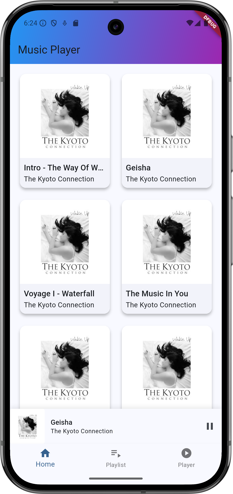
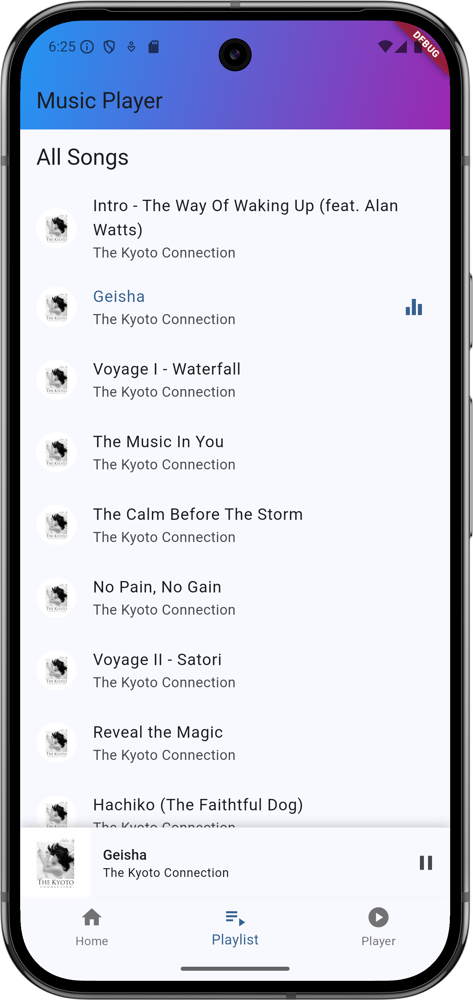
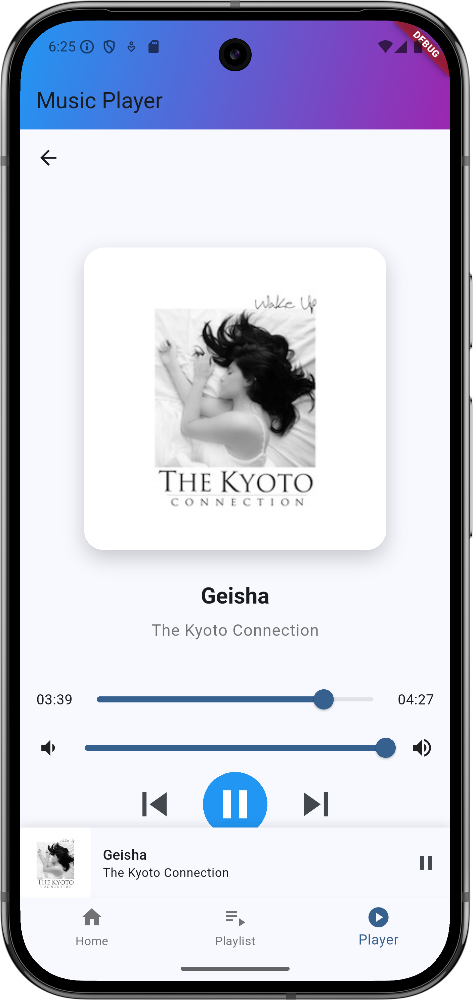

# Music Player App

A Flutter music player application with a modern UI and rich features.

## Features

- Browse songs in grid or list view
- Play/pause, previous/next track controls
- Volume control slider
- Progress bar with seek functionality
- Playlist management
- Mini player with quick access controls
- Full-screen player with artwork display
- Background audio playback

## Getting Started

### Prerequisites

- Flutter SDK (3.7.0 or higher)
- Dart SDK
- Android Studio / VS Code
- Android SDK (for Android development)
- Xcode (for iOS development)

### Installation

1. Clone the repository:
    ```bash
    git clone https://github.com/YoussefSalem582/music_player_app.git
    ```

2. Navigate to project directory:
    ```bash
    cd music_player_app
    ```

3. Install dependencies:
    ```bash
    flutter pub get
    ```

4. Run the app:
    ```bash
    flutter run
    ```

### Dependencies

- `just_audio`: Audio playback
- `path_provider`: File system access
- `http`: Network requests

## Project Structure

lib/
├── models/
│   ├── song.dart
│   └── playlist.dart
├── screens/
│   ├── main_screens.dart
│   ├── music_player_screen.dart
│   └── playlist_screen.dart
├── services/
│   ├── audio_player_service.dart
│   └── music_api_service.dart
├── widgets/
│   ├── custom_appbar.dart
│   └── mini_player.dart
└── main.dart

## Screenshots

### Home Screen


### Playlist Screen


### Music Player Screen


## Contributing

1. Fork the repository
2. Create your feature branch
3. Commit your changes
4. Push to the branch
5. Create a Pull Request
