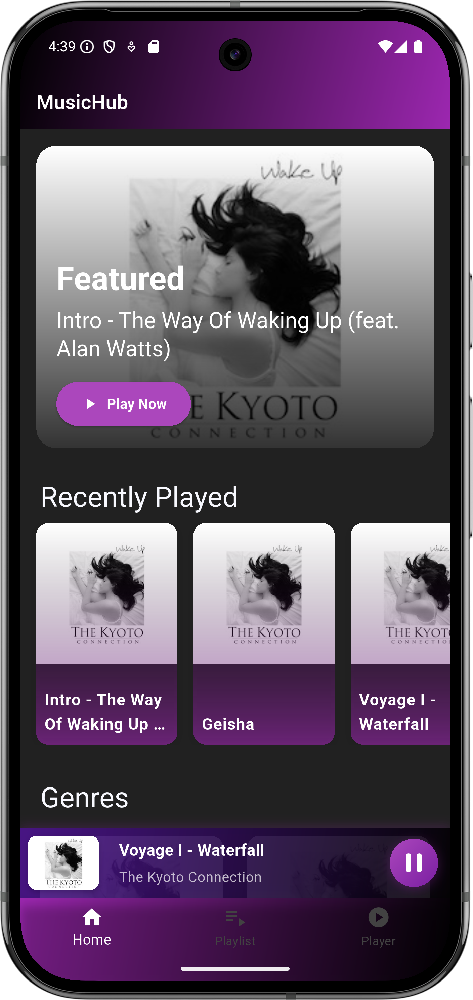
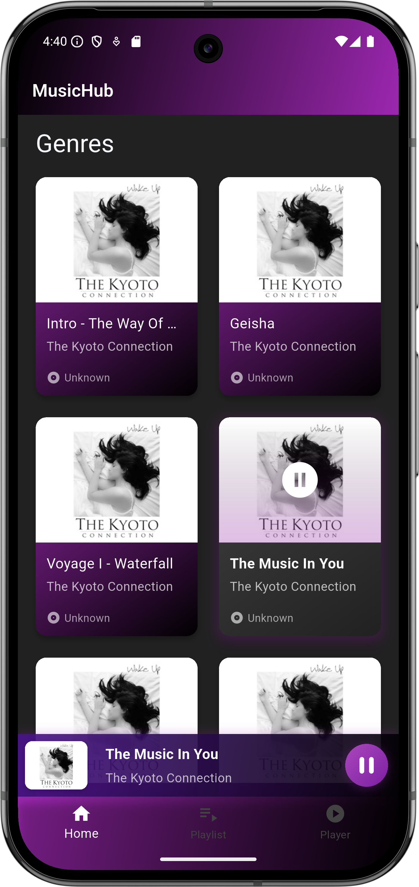
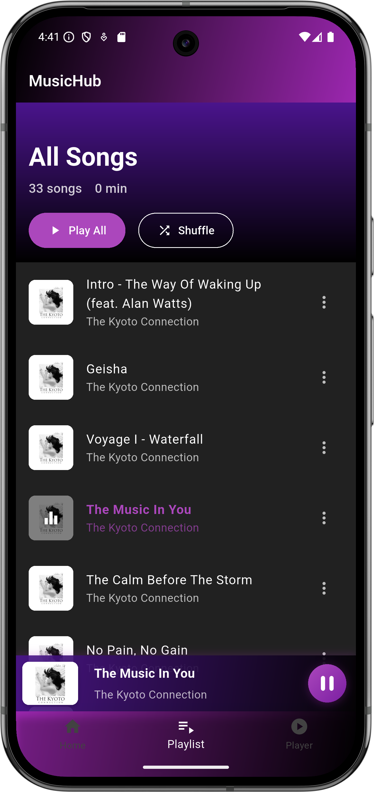
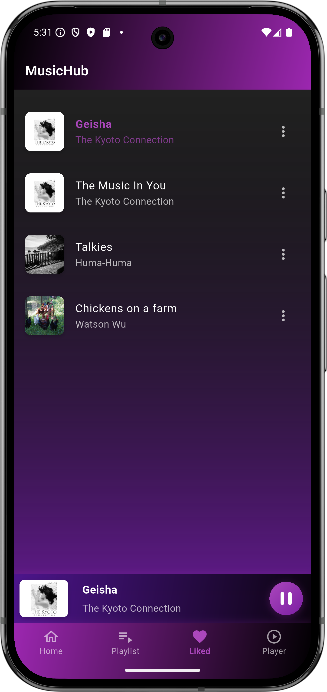
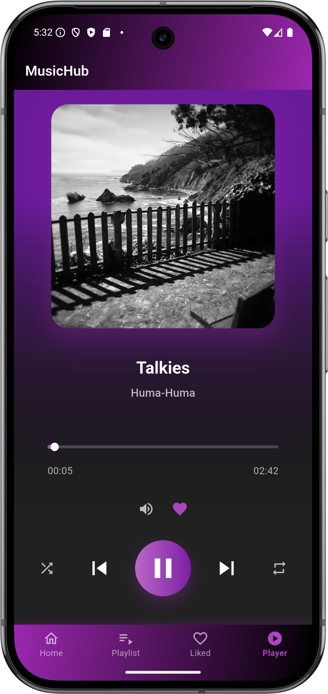

# Music Player App

A modern Flutter music player application featuring a sleek UI with powerful playback controls and
comprehensive music management capabilities. This app delivers an immersive music experience with
features like dynamic playlists, real-time audio controls, and a beautiful gradient interface.

## Key Features

### Playback Controls

- Play/pause, previous/next track navigation
- Adjustable volume with visual slider
- Progress bar with seek functionality
- Shuffle and repeat modes (single/all)
- Background audio playback

### Music Organization

- Grid and list view song browsing
- Genre-based playlists
- Favorites playlist
- Recently played tracks
- Featured music section
- Multi-level playlist management

### UI Features

- Full-screen player with artwork display
- Mini player with quick controls
- Gradient themes and animations
- Custom bottom navigation bar
- Responsive layout design
- Album art hero animations

### Audio Features

- BPM (Beats Per Minute) tracking
- Multiple audio formats support
- Genre classification
- Mood-based sorting
- High-quality audio streaming

## Project Setup

### Requirements

- Flutter SDK (3.7.0 or higher)
- Dart SDK
- Android Studio / VS Code
- Android SDK (for Android)
- Xcode (for iOS)

### Installation

1. Clone the repository:

```bash
git clone https://github.com/YoussefSalem582/music_player_app.git
```

2. Install dependencies:

```bash
cd music_player_app
flutter pub get
```

3. Run the app:

```bash
flutter run
```

## Technical Stack

### Dependencies

- `just_audio`: Advanced audio playback
- `path_provider`: File system management
- `http`: Network operations

### Architecture

```
lib/
├── models/
│   ├── song.dart
│   └── playlist.dart
├── screens/
│   ├── main_screens.dart
│   ├── music_player_screen.dart
│   ├── playlist_screen.dart
│   └── liked_songs.dart
├── services/
│   ├── audio_player_service.dart
│   └── music_api_service.dart
├── widgets/
│   ├── custom_appbar.dart
│   ├── mini_player.dart
│   └── gradient_bottom_navigation_bar.dart
└── main.dart
```

### Key Components

#### Models

- `Song`: Music track metadata and attributes
- `Playlist`: Collection management with various playlist types

#### Services

- `AudioPlayerService`: Audio playback and control management
- `MusicApiService`: Remote music data fetching and caching

#### Screens

- `MainScreen`: Home interface with featured content
- `MusicPlayerScreen`: Full-screen playback interface
- `PlaylistScreen`: Playlist management view
- `LikedSongsScreen`: Favorite tracks collection

#### Custom Widgets

- `MiniPlayer`: Compact playback control bar
- `CustomAppBar`: Gradient-enabled app header
- `GradientBottomNavigationBar`: Custom navigation interface

## Screenshots

### Home View

  

### Playlist View



### Liked Songs



### Player Interface



## Contributing

Contributions are welcome! Please follow these steps:

1. Fork the repository
2. Create your feature branch
3. Commit your changes
4. Push to your branch
5. Create a Pull Request

