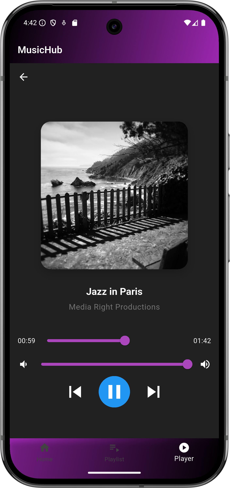

# Music Player App

A Flutter music player application with a modern UI and rich features. This app allows users to
browse, play, and manage their music library with ease. It supports various functionalities such as
playback controls, volume adjustment, playlist management, and more.

## Features

- **Browse Songs**: View songs in grid or list view.
- **Playback Controls**: Play/pause, previous/next track controls.
- **Volume Control**: Slider to adjust volume.
- **Progress Bar**: Seek functionality with a progress bar.
- **Playlist Management**: Create and manage playlists.
- **Mini Player**: Quick access controls with a mini player.
- **Full-Screen Player**: Artwork display in a full-screen player.
- **Background Playback**: Continue playing music in the background.
- **Genre-Based Playlists**: Browse songs by genre.
- **Recently Played**: View recently played songs.
- **Featured Section**: Highlighted featured songs.

## Getting Started

### Prerequisites

- Flutter SDK (3.7.0 or higher)
- Dart SDK
- Android Studio / VS Code
- Android SDK (for Android development)
- Xcode (for iOS development)

### Installation

1. Clone the repository:
    ```bash
    git clone https://github.com/YoussefSalem582/music_player_app.git
    ```

2. Navigate to project directory:
    ```bash
    cd music_player_app
    ```

3. Install dependencies:
    ```bash
    flutter pub get
    ```

4. Run the app:
    ```bash
    flutter run
    ```

### Dependencies

- `just_audio`: Audio playback
- `path_provider`: File system access
- `http`: Network requests

## Project Structure

```
lib/
├── models/
│   ├── song.dart
│   └── playlist.dart
├── screens/
│   ├── main_screens.dart
│   ├── music_player_screen.dart
│   └── playlist_screen.dart
├── services/
│   ├── audio_player_service.dart
│   └── music_api_service.dart
├── widgets/
│   ├── custom_appbar.dart
│   └── mini_player.dart
└── main.dart
```

### Models

- **Song**: Represents a song with attributes like title, artist, URL, cover URL, genre, etc.
- **Playlist**: Represents a playlist containing a list of songs and additional metadata.

### Screens

- **MainScreen**: The main screen of the app, displaying featured songs, recently played songs,
  genres, and all songs.
- **MusicPlayerScreen**: The full-screen music player with playback controls and song details.
- **PlaylistScreen**: Displays songs in a specific playlist.

### Services

- **AudioPlayerService**: Manages audio playback using the `just_audio` package.
- **MusicApiService**: Fetches songs from a remote API.

### Widgets

- **CustomAppBar**: A custom app bar with a gradient background.
- **MiniPlayer**: A mini player widget for quick access to playback controls.

## Screenshots

### Home Screen


### Playlist Screen


### Music Player Screen


## Additional Information

This project uses the following technologies and frameworks:

- Flutter
- Dart
- Kotlin
- Java
- Gradle
- C++

## Contributing

1. Fork the repository
2. Create your feature branch
3. Commit your changes
4. Push to the branch
5. Create a Pull Request
